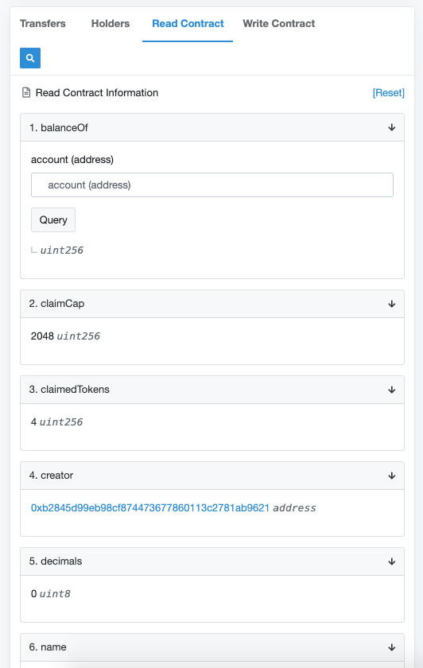
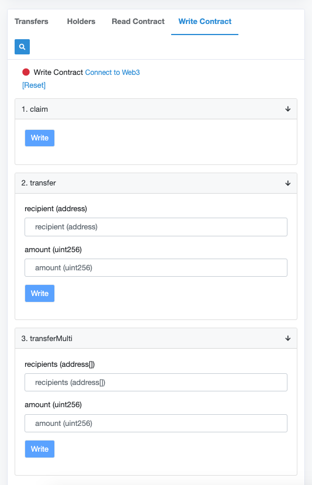

# Cunning Token (CUNT) 💎 - a coin that sticks
[][Etherscan]

[][EtherscanRinkeby]
----

Cunning Token (CUNT) is an ERC20 Token on the Ethereum Blockchain, created by a bored developer. Nothing special so far, there are thousand like it - except
> **You can't get rid of it.**

You can try as hard as you like, once you've got it in your wallet, it sticks with you. It can't be burnt nor transferred for good, it kinda just... grows back?!🙄

CUNT is therefore the perfect giveaway for crypto-beggars, scammers and other lowlife; or just a fellow degenerate. Ever wanted to carve "GFY" into someone's wallet permanently? We've got you covered!

## Token mechanics
- CUNT can be transferred like any other token - but if your balance drops to zero, a new CUNT is minted and transferred to your wallet
- No Hard Cap, zero decimals
- The first 2048 CUNT can be claimed for free (4 CUNT per claim, one claim per wallet)
- Pre-Mint: 500 CUNT, for 'giveaways'

## How to get CUNT
You cannot trade or buy CUNT on an exchange, as
1. supply could be inflated by bad actors if financial incentives would be involved, and
2. (more importantly) who in their right mind would list this?

If you too want to share CUNT with your least favourite Etherians, there are **3 ways** to get you started.

But first, **Get MetaMask**. We recommend using [MetaMask](https://www.metamask.io), either on Mobile or Desktop. Other wallets were not tested and may not play nicely with [Etherscan]. Also, [get some ETH][Coinbase] to pay for the gas.

### 1. Claim CUNT for free
2048 tokens are available to be claimed for free from the smart contract directly. Every wallet can claim 4 tokens once, which means this is limited to the *first 512 users*.
- with [MetaMask] ready, go to the [Smart Contract on Etherscan][Etherscan].
- click the **Read Contract** Tab. Here you can see basic information about the token, and also the counter for `claimedTokens`. If this is *2048* (the `claimCap`), you can't claim tokens anymore.

- click the **Write Contract** Tab

- Click "Connect to Web3" to unlock MetaMask
- Click "Claim", and set the **Gas Limit** to at least 100k in MetaMask *(important! your transaction may fail otherwise, and burn your gas)*

### 2. Throw us some dust
CUNT can also be minted for a small donation to the project. Send at least half a Finney ([= 0.0005 ETH][ccUnit], 10c @ 200 ETH/USD) to get some tokens in return.
- Open MetaMask, click "Send"
- Enter the [CUNT Smart Contract Adress][Etherscan] as recipient: `0xa06b79b41bc24a83c350ff3f74c7beaf96574d71`

[][Etherscan]

- Enter the amount of ETH you'd like to send (0.0005 ETH min to get tokens).
- Set the **Gas Limit** to at least 65k in MetaMask *(important! your transaction may fail otherwise, and burn your gas)*
- You'll get 4 CUNT for every Finney you've sent (== 0.00025 ETH/CUNT)

### 3. Reach out
Hopefully there will be plenty of CUNT-bagholders soon. Reach out on Twitter using the cashtag [$CUNT][Twitter] and someone may hook you up😅

[][Twitter]

----

## FAQ

### Why CUNT?
I just wanted to play around with unusual Token mechanics and claiming possibilities, and got tired of the cheap BOMB-knockoffs flooding Reddit and Twitter, so I tried to come up with something "original". I got super excited when I realised nobody else has thought about something *this* stupid before.

### How much Gas is CUNT using?
We don't want you to run into "out-of-gas" situations when interacting with CUNT, so set the following gas **limits** when calling the contract (you can check current [Gas *prices* here][ccGas]). Better DApp-wallets like [MetaMask] will do this for you automatically, but even they get some of the values wrong sometimes.

Please double-check and adjust your gas **limit** for the following calls, to not burn your gas by accident:
- `claim`: 100k Gas
- `transfer`: 63k Gas (~5k less when *not* minting new tokens)
- `transferMulti`: 30k Gas base call + 25k/address (no minting; may be more, add buffer)
- `sending ETH to the contract`: 65k Gas

### No DApp or Social Media?
No need for the fanciness really. Tokens can be claimed using [MetaMask] and [Etherscan], and transferred by any ERC20-compatible wallet. Creating a DApp for this project would be an overstatement 😝

Same goes for Social Media - this is a fun project and not an elaborate exit scam, no need for Telegram Groups and thousands of Twitter followers.
If you want to get in touch, use the cashtag [$CUNT][Twitter] on Twitter.

[][Twitter]

### You know there's a $CUNT token already, right?
F**k those $CUNTs. I mean, come on, *Chinese Unified National Token*? Seriously?

### Why exactly 2048 claimable coins?
Because 42 or 420 weren't enough, and 69.420 would have been too much.

----

## License
[GNU General Public License v3.0](https://www.gnu.org/licenses/gpl-3.0.en.html) - if you create a knock-off, at least publish the source code.

## Special thanks to
[OpenZeppelin] for their awesome Solidity contracts framework, [Truffle] for the toolset, and each and every [Ethereum Core][Ethereum] Dev.

----
**Keep sharing the ❤️**

[//]: #
   [MetaMask]: <https://www.metamask.io>
   [Etherscan]: <https://etherscan.io/token/0xa06b79b41bc24a83c350ff3f74c7beaf96574d71>
   [EtherscanRinkeby]: <https://rinkeby.etherscan.io/token/0xa06b79b41bc24a83c350ff3f74c7beaf96574d71>
   [ccGas]: <https://chaincraft.cc/ethereum-gasprice>
   [ccUnit]: <https://chaincraft.cc/ether-unit-converter>
   [OpenZeppelin]: <https://github.com/OpenZeppelin/openzeppelin-contracts>
   [Truffle]: <https://github.com/trufflesuite/truffle>
   [Ethereum]: <https://github.com/ethereum>
   [Coinbase]: <https://www.coinbase.com/join/5a4fe76e49d3f302a1111321>
   [Twitter]: <https://twitter.com/search?q=%24CUNT>
